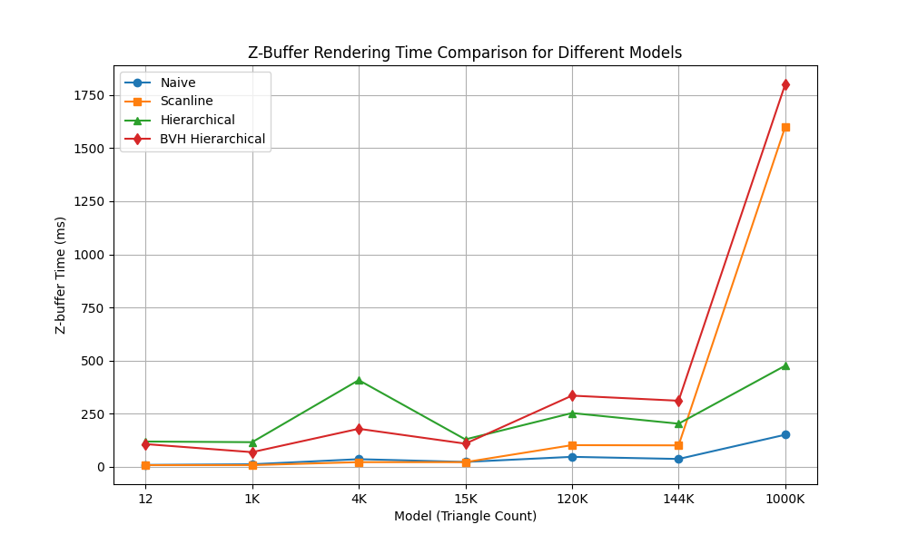

# ZBuffer


## Introduction

A simple software rasterizer that includes model loading, vertex shader, zbuffer, and fragment shader functionalities.

- **ZBuffer** includes traditional zbuffer, scanline zbuffer, hierarchical zbuffer, and BVH hierarchical zbuffer.
- **Fragment Shader** includes rendering normals, rendering depth, rendering triangle face IDs, and the Blinn-Phong lighting model.


## Building and Running

Before compiling, navigate to `main.cpp` and modify:

```cpp
std::vector<std::string> filenames；
std::vector<std::string> output_filenames；
```

to either relative or absolute paths, otherwise the model cannot be loaded or the rendered image saved. You can also modify the `Pattern type` in `main.cpp` to change the fragment shader mode.

### Windows 11

Compiler: Visual Studio 2022

Navigate to the project root directory and run the following commands in cmd:

```cmd
mkdir build
cd build
cmake .. -G "Visual Studio 17 2022"
cmake --build . --config Release
```

The executable will be generated in `build/src/Release`.

### MacOS

Compiler: Xcode. Ensure that CMake and Xcode command-line tools are installed on your system.

Navigate to the project root directory and run the following commands in the terminal:

```bash
mkdir build
cd build
cmake .. -G "Xcode"
xcodebuild -configuration Release
```

The executable will be generated in `build/src/Release`.

### Linux

Compiler: g++.

Navigate to the project root directory and run the following commands in the terminal:

```bash
cmake -DCMAKE_BUILD_TYPE=Release -S . -B build
cd build
make -j${proc}
```

The executable will be generated in `build/src/`.


## Results

Demonstrates the rendering results of 7 models, with a resolution of $1280\times 1280$ and face counts of 12, 1K, 4K, 15K, 120K, 144K, and 1000K.

### Normal shading

<div style="display: grid; grid-template-columns: repeat(4, 1fr); gap: 10px;">
    <div>
    
    
    
    
    
    
    
    <p style="margin-top: 10px;">Naive</p>
    </div>
    <div>
    
    
    
    
    
    
    
    <p style="margin-top: 10px;">Scanline</p>
    </div>
    <div>
    
    
    
    
    
    
    
    <p style="margin-top: 10px;">Hierarchical</p>
    </div>
    <div>
    
    
    
    
    
    
    
    <p style="margin-top: 10px;">BVH Hierarchical</p>
    </div>
</div>

### Triangle id shading

<div style="display: grid; grid-template-columns: repeat(4, 1fr); gap: 10px;">
    <div>
    
    
    
    
    
    
    
    <p style="margin-top: 10px;">Naive</p>
    </div>
    <div>
    
    
    
    
    
    
    
    <p style="margin-top: 10px;">Scanline</p>
    </div>
    <div>
    
    
    
    
    
    
    
    <p style="margin-top: 10px;">Hierarchical</p>
    </div>
    <div>
    
    
    
    
    
    
    
    <p style="margin-top: 10px;">BVH Hierarchical</p>
    </div>
</div>
### Depth shading

<div style="display: grid; grid-template-columns: repeat(4, 1fr); gap: 10px;">
    <div>
    
    
    
    
    
    
    
    <p style="margin-top: 10px;">Naive</p>
    </div>
    <div>
    
    
    
    
    
    
    
    <p style="margin-top: 10px;">Scanline</p>
    </div>
    <div>
    
    
    
    
    
    
    
    <p style="margin-top: 10px;">Hierarchical</p>
    </div>
    <div>
    
    
    
    
    
    
    
    <p style="margin-top: 10px;">BVH Hierarchical</p>
    </div>
</div>
### Blinn-Phong shading

<div style="display: grid; grid-template-columns: repeat(4, 1fr); gap: 10px;">
    <div>
    
    
    
    
    
    
    
    <p style="margin-top: 10px;">Naive</p>
    </div>
    <div>
    
    
    
    
    
    
    
    <p style="margin-top: 10px;">Scanline</p>
    </div>
    <div>
    
    
    
    
    
    
    
    <p style="margin-top: 10px;">Hierarchical</p>
    </div>
    <div>
    
    
    
    
    
    
    
    <p style="margin-top: 10px;">BVH Hierarchical</p>
    </div>
</div>


## Performance Comparison

All performance tests were conducted in a single-threaded environment, with a resolution of $1280\times 1280$.



The fastest method is the traditional pixel-by-pixel ZBuffer, which works by iterating through each triangle and updating the depth values of pixels within its projected 2D bounding box.

In the range of hundreds of thousands of triangles, the scanline ZBuffer performs similarly to the pixel-by-pixel ZBuffer, though slightly slower. The scanline ZBuffer is theoretically faster than the pixel-by-pixel ZBuffer because it stores the slope information and depth gradients of triangles. However, it incurs additional overhead as it requires building a sorted polygon table and sorted edge table for each frame, and the insertion and deletion operations in the active edge table and active polygon table also consume time. Consequently, when the number of triangles becomes extremely large, the scanline ZBuffer needs to expend significant computational resources to maintain these table relationships, resulting in suboptimal performance at 1000K triangles.

The hierarchical ZBuffer offers a theoretical speedup by allowing entire triangles to be rejected at a coarse level, but this assumes that triangles are traversed from near to far. If triangles are traversed from far to near, the hierarchical ZBuffer not only fails to reject triangles at a coarse level but also wastes additional time on recursive queries and depth updates.

The hierarchical bounding volume (BVH) combined with the hierarchical ZBuffer further enables the ZBuffer to reject all triangles within a bounding box at a coarse level. However, the drawback is that each frame requires the construction of a BVH acceleration structure for the triangles projected into NDC space, which cannot be parallelized, thus incurring significant time overhead.